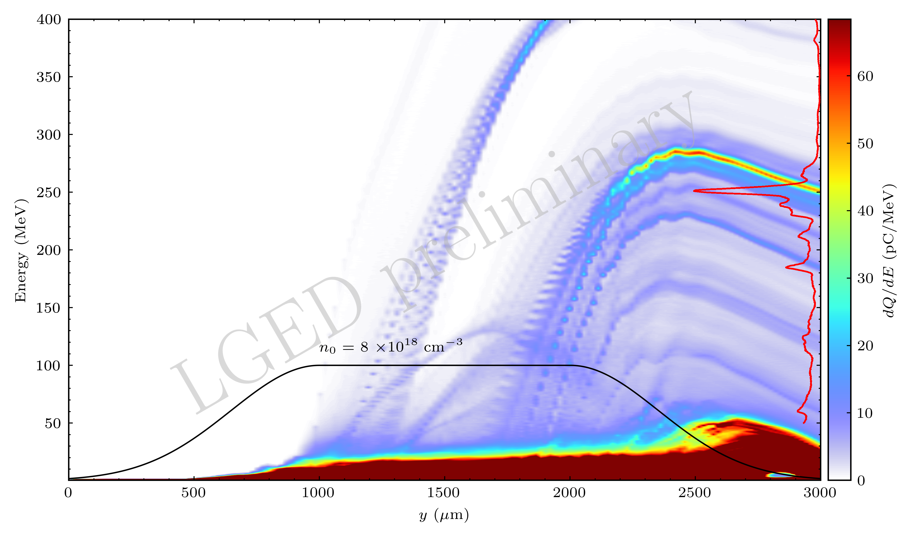

# Time histogram plotter
Plot time evolution of electron energy spectrum with the density profile.

To run, `python histogram_evol.py`. To generate the corresponding `jupyter notebook`, we use [`jupytext`](https://github.com/mwouts/jupytext). 

To generate a jupyter notebook from a Python script, do:

```console
jupytext histogram_evol.py --to ipynb
```

One then has to delete the original Python script, which will be re-generated by Jupyter.

For `LaTeX` font rendering of `matplotlib` figures, under `Ubuntu 20.04`:

```console
$ sudo apt install dvipng texlive-latex-extra texlive-fonts-recommended cm-super
```


